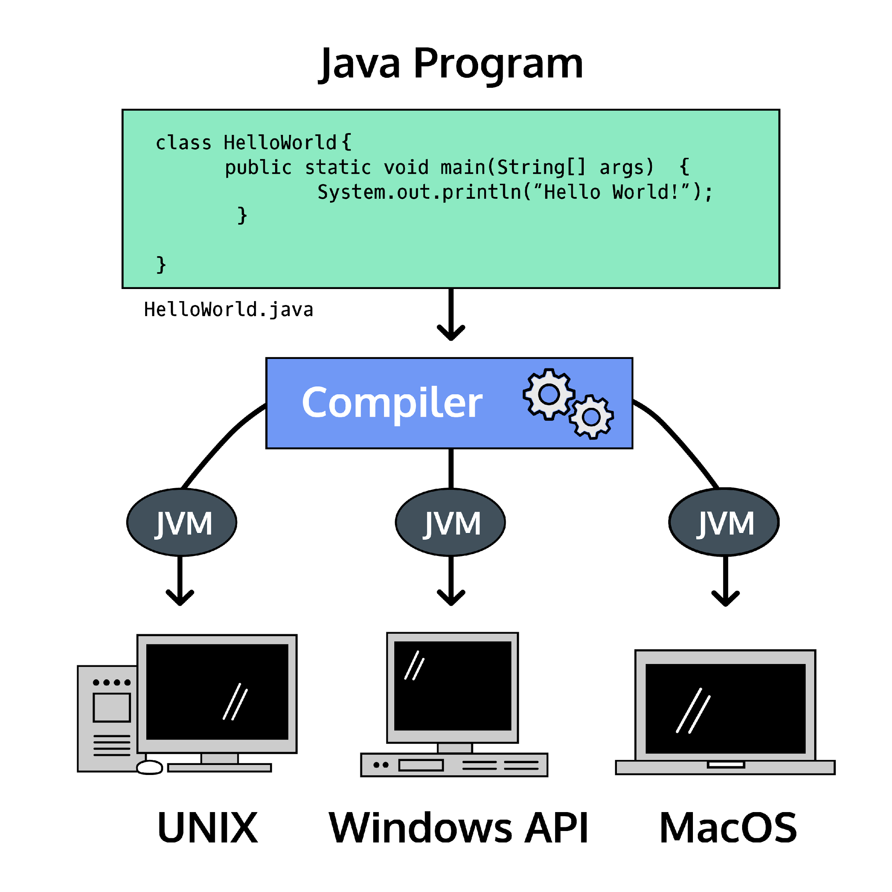
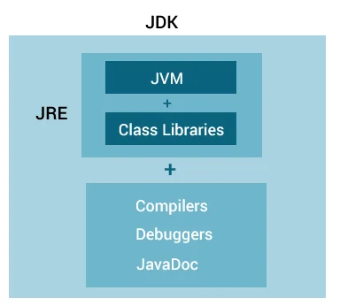
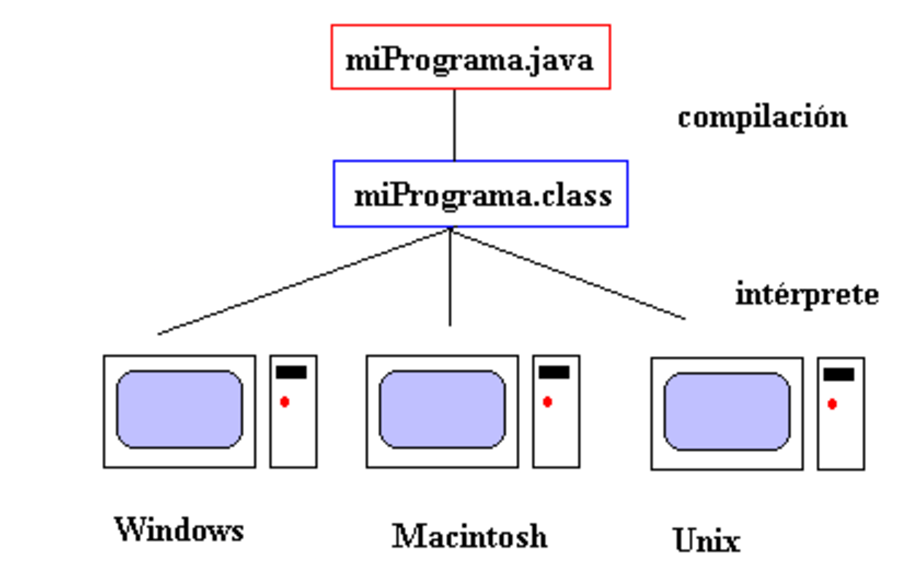
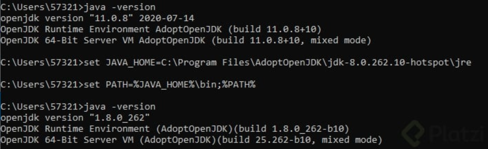
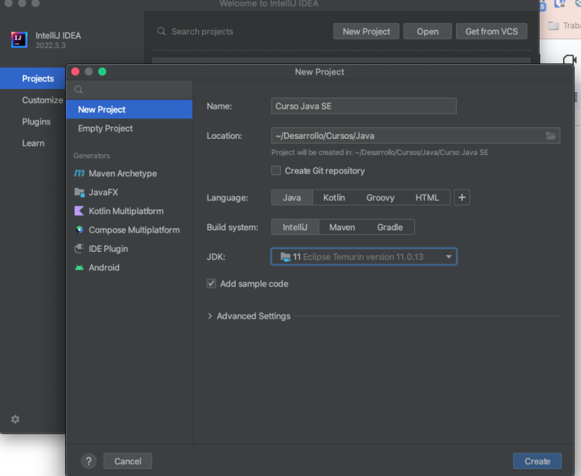
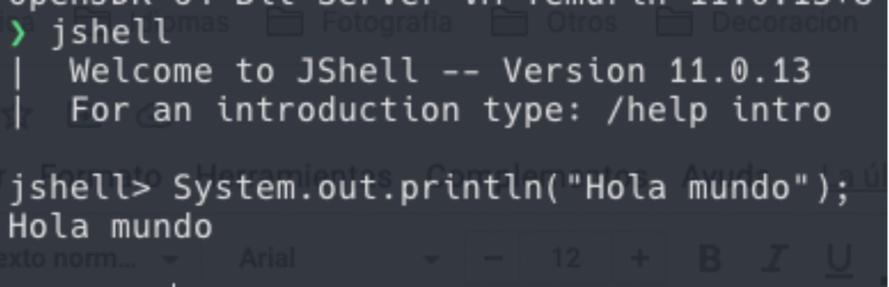
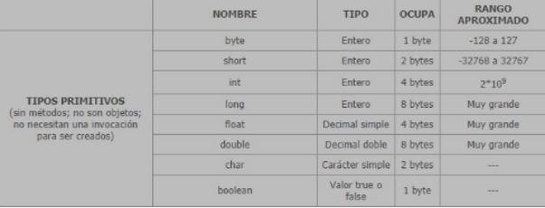
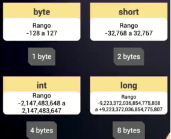
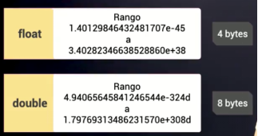

# ¡Curso Básico de Java SE!
*Tu puerta de entrada al mundo de la programación robusta y multiplataforma.*

---

### **¿Qué es Java?**  
Java es un **lenguaje de programación orientado a objetos (POO)** diseñado para ser *sencillo, seguro y multiplataforma*. Creado en 1991 por **James Gosling** en Sun Microsystems (adquirido por Oracle en 2009), Java revolucionó la industria con una filosofía única: **"Write Once, Run Anywhere" (WORA)**. Esto significa que un programa escrito en Java puede ejecutarse en cualquier dispositivo o sistema operativo que tenga instalada la **Máquina Virtual de Java (JVM)**, sin necesidad de modificaciones.  

Aunque es un lenguaje de **alto nivel** (menos cercano al hardware que C++ o Assembly), Java no es tan abstracto como Python o JavaScript. Esta combinación lo hace ideal para aprender fundamentos sólidos de programación mientras se desarrollan aplicaciones reales.  

---

### **Java: Más que un lenguaje, una plataforma**  
Java es **tanto un lenguaje como una plataforma**:
- **Como lenguaje**: Define reglas (sintaxis) para escribir instrucciones que la computadora ejecuta.  
- **Como plataforma**: Incluye herramientas como el **JDK (Java Development Kit)** para compilar código, la **JVM** para ejecutarlo, y bibliotecas estándar (*Java API*) que simplifican tareas complejas.  

  

El proceso es mágico pero sencillo:  
1. Escribes código en un archivo `.java`.  
2. El **compilador** lo convierte en **bytecode** (archivo `.class`).  
3. La **JVM** traduce el bytecode a instrucciones específicas para tu sistema operativo.  

---

### **¿Por qué Java sigue siendo relevante después de 30 años?**  
- **Multiplataforma**: Corre en Windows, Linux, macOS, dispositivos embebidos y hasta en tu cafetera inteligente.  
- **Orientado a objetos**: Fomenta código modular y reutilizable (clases, herencia, polimorfismo).  
- **Robusto y seguro**: Manejo automático de memoria (*garbage collection*), verificación de código en tiempo real.  
- **Comunidad gigante**: Miles de librerías (Spring, Hibernate) y frameworks para todo tipo de proyectos.  
- **Reina de las empresas**: Es el lenguaje detrás de sistemas bancarios, aplicaciones Android, servidores y Big Data.  

---

### **Java SE vs. Java EE: ¿En qué se diferencian?**  
- **Java Standard Edition (SE)**:  
  - Base del lenguaje: sintaxis, estructuras de datos, algoritmos.  
  - Ideal para: Aplicaciones de escritorio (*JavaFX*), consola, y móviles (con Android SDK).  

- **Java Enterprise Edition (EE)**:  
  - Extiende Java SE para entornos corporativos.  
  - Usado en: Aplicaciones web escalables, APIs REST, microservicios (*Jakarta EE*).  

**¡Lo mejor?** Todo lo que aprendas en Java SE será la base para dominar Java EE o frameworks modernos como Spring Boot.  

---

### **¿Para qué se usa Java en el mundo real?**  
- 📱 **Aplicaciones Android**: El 90% de las apps en Google Play usan Java o Kotlin (que corre en la JVM).  
- 🏦 **Software empresarial**: Sistemas de bancos, seguros y gobiernos.  
- 🌐 **Tecnologías web**: Servidores como Apache Tomcat y herramientas como Hadoop para Big Data.  
- 🔬 **Cómputo científico**: Procesamiento de datos en astronomía, biología y machine learning.  
- 🕹️ **IoT y hardware**: Tarjetas inteligentes, sistemas embebidos en automóviles.  

---

### **¿Por qué aprender Java en 2025?**  
- **Demanda laboral**: Java sigue en el top 3 de lenguajes más solicitados (TIOBE Index).  
- **Salarios competitivos**: Desarrolladores Java tienen un promedio de $70k-$120k anuales en EE.UU.  
- **Puerta a otros lenguajes**: Su sintaxis influenció a C#, JavaScript y Kotlin.  
- **Versatilidad**: Desde Minecraft hasta el rover de Marte, Java está en todas partes.  

---

### **¿Qué aprenderás en este curso?**  
- 📖 **Fundamentos de Java SE**: Variables, operadores, condicionales, bucles.  
- 🧩 **Programación orientada a objetos**: Clases, objetos, herencia, interfaces.  
- 🛠️ **Herramientas esenciales**: JDK, IDEs como IntelliJ o Eclipse.  
- 🚀 **Proyectos prácticos**: Crearás aplicaciones de consola y de escritorio desde cero.  

**Prepárate para escribir tu primer "¡Hola, Mundo!" y descubrir por qué millones de desarrolladores confían en Java.**  

---

### **🚀 Java SE: Versiones, Arquitectura y Herramientas Esenciales**  
*Domina las bases técnicas para convertirte en un desarrollador Java eficiente.*  

---

#### **🔄 Versiones de Java: Evolución y Licencias**  
Java ha evolucionado constantemente desde su lanzamiento en 1995. Cada versión trae mejoras, pero es crucial entender su ciclo de vida:  


| **Versión**         | **Fecha de Lanzamiento**   |  
|----------------------|----------------------------|  
| JDK Beta             | 1995                      |  
| JDK 1.0              | Enero 1996                |  
| JDK 1.1              | Febrero 1997              |  
| J2SE 1.2             | Diciembre 1998            |  
| J2SE 1.3             | Mayo 2000                 |  
| J2SE 1.4             | Febrero 2002              |  
| J2SE 5.0             | Septiembre 2004           |  
| Java SE 6            | Diciembre 2006            |  
| Java SE 7            | Julio 2011                |  
| Java SE 8 (LTS)      | Marzo 2014                |  
| Java SE 9            | Septiembre 2017           |  
| Java SE 10           | Marzo 2018                |  
| Java SE 11 (LTS)     | Septiembre 2018           |  
| Java SE 12           | Marzo 2019                |  


A partir de la version Java SE 9  Oracle libera versiones cada 6 meses

| **Versión**          | **Fecha de Lanzamiento**   | **Tipo**      |  
|-----------------------|----------------------------|---------------|  
| Java SE 12            | Marzo 2019                | No-LTS        |  
| Java SE 13            | Septiembre 2019           | No-LTS        |  
| Java SE 14            | Marzo 2020                | No-LTS        |  
| Java SE 15            | Septiembre 2020           | No-LTS        |  
| Java SE 16            | Marzo 2021                | No-LTS        |  
| **Java SE 17 (LTS)**  | Septiembre 2021           | **LTS**       |  
| Java SE 18            | Marzo 2022                | No-LTS        |  
| Java SE 19            | Septiembre 2022           | No-LTS        |  
| Java SE 20            | Marzo 2023                | No-LTS        |  
| **Java SE 21 (LTS)**  | Septiembre 2023           | **LTS**       |  
| Java SE 22            | Marzo 2024                | No-LTS        |  
| Java SE 23            | Septiembre 2024           | No-LTS        |  
| Java SE 24            | Marzo 2025                | No-LTS        |  
| **Java SE 25 (LTS)**  | Septiembre 2025*           | **LTS**       |  

---

### **Notas clave**:  
1. **Ciclo de lanzamiento**: Desde 2017, Oracle libera versiones cada **6 meses** (marzo y septiembre).  
2. **Versiones LTS**: Reciben soporte extendido (ej: Oracle JDK ofrece hasta **8 años** de soporte premium). Las LTS posteriores a 2018 son:  
   - **Java 11 (2018)**, **Java 17 (2021)**, **Java 21 (2023)**, y **Java 25 (2025)**.  
3. **Versiones No-LTS**: Soporte limitado (hasta el lanzamiento de la siguiente versión).  
4. *Java 25*: Aún no confirmada oficialmente, pero sigue el patrón de LTS cada 3 años.  


---

#### **🏗️ Arquitectura de Java: JDK, JRE y JVM**  
Java no es solo código: es un ecosistema de herramientas. Aquí su estructura:  

  

1. **JDK (Java Development Kit)**:  
   - **Compilador**: Traduce código `.java` a **bytecode** (archivos `.class`).  
   - **JRE (Java Runtime Environment)**: Entorno para ejecutar aplicaciones.  
   - **APIs**: Bibliotecas predefinidas (*java.util*, *java.io*).  
   - **Herramientas adicionales**: Depurador, generador de documentación (*javadoc*).  

2. **JRE (Java Runtime Environment)**:  
   - **JVM (Java Virtual Machine)**: Ejecuta bytecode en cualquier sistema operativo.  
   - **Bibliotecas estándar**: Funciones esenciales para I/O, redes, gráficos.  

3. **JVM (Java Virtual Machine)**:  
   - **Intérprete + JIT Compiler**: Convierte bytecode en instrucciones específicas del sistema.  
   - **Garbage Collector**: Libera memoria automáticamente.  

🔍 **Relación entre JDK, JRE y JVM**:  
  

---

#### **⚙️ ¿Cómo Java es *multiplataforma*?**  
Java combina **compilación** e **interpretación**:  
1. **Compilas** tu código `.java` a bytecode (`.class`).  
2. La **JVM** interpreta el bytecode y lo adapta al sistema operativo.  

  

**Ejemplo**: Un programa compilado en Windows funcionará en Linux *sin cambios*, gracias a la JVM específica de cada OS.  

---

#### **🛠️ Configuración de Entorno: Cambiar Versiones de Java**  
Si tienes múltiples versiones instaladas:  
- **Por línea de comandos** (Windows):  
  ```bash  
  setx JAVA_HOME "C:\Program Files\Java\jdk-11"  
  ```  
    

- **En IntelliJ IDEA**:  
    

---

#### **🔍 Herramientas Clave: JShell y JAR**  
- **JShell (Java 9+)**:  
  - Consola interactiva para probar código sin crear proyectos.  
  ```bash  
  jshell  
  > System.out.println("¡Hola desde JShell!");  
  ```  
    

- **Archivos JAR**:  
  - Empaquetan múltiples `.class` en un solo archivo comprimido (como ZIP).  
  - Ejecutables con:  
    ```bash  
    java -jar mi_app.jar  
    ```  
  - Requieren una JVM igual o superior a la versión de compilación.  

---

#### **📦 Plataformas Java: Más Allá de SE**  
Java se adapta a distintos contextos:  

| **Plataforma** | **Uso Principal** |  
|----------------|-------------------|  
| **Java SE**    | Aplicaciones de escritorio, consola y Android. |  
| **Java EE**    | Sistemas empresariales (APIs REST, microservicios). |  
| **Java ME**    | Dispositivos embebidos (IoT, tarjetas inteligentes). |  
| **JavaFX**     | Interfaces gráficas modernas con efectos multimedia. |  

---

### **📅 Java en la Actualidad**
*Desde Java 8 hasta Java 17: ¿Qué necesitas saber para empezar?*  

---

#### **🔄 Java 8 vs. Java 11 vs. Java 17: Elige tu Versión**  
Java sigue evolucionando, pero las empresas priorizan **estabilidad sobre novedad**. Aquí un resumen clave:  

| **Versión** | **Estado** | **Soporte** |  
|-------------|------------|--------------|  
| **Java 8 (LTS)** | La más popular hasta 2023. Usada en el 65% de proyectos (Según JetBrains, 2022). | Soporte gratuito hasta **diciembre 2020**. Post 2020, Oracle cobra por actualizaciones críticas. |  
| **Java 11 (LTS)** | Versión recomendada para nuevos proyectos. | Soporte LTS hasta **septiembre 2026** (gratuito con OpenJDK). |  
| **Java 17 (LTS)** | Última LTS (2021). Incluye mejoras de rendimiento y sintaxis. | Soporte hasta **2029**. |  

**¿Por qué Java 8 sigue siendo reina?**  
- **Legado**: Muchos sistemas bancarios y gubernamentales la usan.  
- **Familiaridad**: Lambdas y Streams (*Java 8*) aún son la base de muchos tutoriales.  
- **Coste de migración**: Actualizar a Java 11+ puede romper código antiguo.  

**En este curso**: Usaremos **Java 8, 11 y 17** para entender tanto código heredado como buenas prácticas modernas.  

---

#### **🛠️ Herramientas Imprescindibles**  
1. **Gestores de Dependencias**:  
   - **Maven**:  
     - *Ventaja*: Configuración centralizada en `pom.xml`.  
     - *Desventaja*: XML puede ser verboso.  
   - **Gradle**:  
     - Usa Kotlin/Groovy para scripts más limpios.  
     - Ideal para proyectos Android y microservicios.  

2. **Frameworks Estrella**:  
   - **Spring (Java EE/Spring Boot)**:  
     - Crea APIs REST, aplicaciones web y microservicios con anotaciones simples (`@RestController`, `@Autowired`).  
     - Incluye Spring Security (autenticación) y Spring Data JPA (bases de datos).  
   - **Hibernate (ORM)**:  
     - Mapea objetos Java a tablas de bases de datos sin escribir SQL manual.  
     - Ejemplo: `@Entity` para convertir una clase en una tabla.  

---

#### **💻 IDEs: Elige tu Arma**  
Un **IDE** es tu taller de desarrollo: editor de código, depurador, integración con Git y más. Opciones clave:  

| **IDE** | **Ventajas** | **Desventajas** |  
|---------|--------------|------------------|  
| **IntelliJ IDEA**  | - Soporte nativo para Kotlin y Spring. <br> - Autocompletado inteligente. | - La versión Ultimate es de pago (≈$50/mes). |  
| **Eclipse** | - Gratuito y personalizable. <br> - Spring Tool Suite (STS) integra Spring. | - Interfaz menos intuitiva. |  
| **NetBeans** | - Oficial de Oracle. <br> - Ideal para JavaFX. | - Menos popular desde 2020. |  

**Recomendación**:  
- **Principiantes**: Usa **IntelliJ IDEA Community Edition** (gratis).  
- **Desarrollo Empresarial**: **Spring Tool Suite (basado en Eclipse)** para integración con Spring Boot.  

---

#### **🚀 Java en 2024: Tendencias**  
- **Jakarta EE**: La evolución *open-source* de Java EE para aplicaciones en la nube.  
- **Quarkus**: Framework para microservicios rápidos (usa menos memoria que Spring).  
- **Kotlin**: Lenguaje moderno que corre en la JVM, 100% compatible con Java.  

---

### **🔧 Configura tu Entorno**  
**Pasos para empezar**:  
1. **Descarga JDK 11**: Usa [OpenJDK](https://adoptium.net/) (gratis).  
2. **Instala IntelliJ IDEA**: [Versión Community](https://www.jetbrains.com/idea/).  
3. **Crea tu Primer Proyecto**:  
   - Selecciona **Maven** o **Gradle**.  
   - ¡Escribe tu primer `HolaMundo.java`!  

```java  
public class HolaMundo {  
    public static void main(String[] args) {  
        System.out.println("¡Java nunca murió!");  
    }  
}  
```  

---

### **🖥️ Tu Primer Programa en Java: ¡Hola Mundo!**  
*De la teoría a la práctica: escribe, compila y ejecuta tu primer código.*  

---

#### **📝 Estructura Básica de un Programa Java**  
Todo programa en Java gira alrededor de dos elementos clave:  
1. **Clase Principal**: Debe coincidir exactamente con el nombre del archivo (incluyendo mayúsculas).  
2. **Método `main`**: Punto de entrada del programa. Sin él, la JVM no sabrá por dónde empezar.  

```java
public class HolaMundo {
    public static void main(String[] args) {
        System.out.println("¡Hola Mundo!");
    }
}
```

**Desglose del código**:  
- **`public class HolaMundo`**: Define una clase pública llamada `HolaMundo`.  
- **`public static void main(String[] args)`**: Método principal.  
  - `public`: Accesible desde cualquier lugar.  
  - `static`: No requiere una instancia de la clase para ejecutarse.  
  - `void`: No retorna ningún valor.  
  - `String[] args`: Permite pasar argumentos desde la consola.  
- **`System.out.println()`**: Imprime texto en la consola y añade un salto de línea.  

---

#### **⚙️ Ejecución Paso a Paso**  
1. **Guarda el código** en un archivo llamado `HolaMundo.java`.  
2. **Compila** desde la terminal:  
   ```bash
   javac HolaMundo.java
   ```  
   Esto genera un archivo `HolaMundo.class` (bytecode).  
3. **Ejecuta** el programa:  
   ```bash
   java HolaMundo
   ```  
   Salida:  
   ```bash
   ¡Hola Mundo!
   ```  

**💡 Consejo**: En un IDE como IntelliJ, haz clic derecho y selecciona *Run 'HolaMundo.main()'*.  

---

#### **🔍 Sintaxis Clave y Buenas Prácticas**  
- **Case Sensitivity**: `HolaMundo` ≠ `holamundo`.  
- **Llaves `{}`**: Delimitan bloques de código (clases, métodos).  
- **Punto y coma `;`**: Termina cada instrucción.  
- **Comentarios**:  
  - **Una línea**: `// Esto es un comentario`.  
  - **Varias líneas**:  
    ```java
    /* Este es un comentario 
       de múltiples líneas */
    ```  
  - **Javadoc**:  
    ```java
    /**
     * Descripción de la clase o método.
     * @author TuNombre
     */
    ```  

---

#### **🖨️ System.out.println() vs System.out.print()**  
| **Método** | **Comportamiento** | **Ejemplo** | **Salida** |  
|------------|--------------------|-------------|------------|  
| `println()` | Imprime y añade salto de línea |```System.out.println("Hola");``` <br> ```System.out.println("Mundo");``` | Hola <br> Mundo|
| `print()` | Imprime en la misma línea |  ```System.out.print("Hola ");```<br> ```System.out.print("Mundo");```| Hola Mundo |
 
---

### **🔧 Proceso de Compilación: De Código a Ejecución**  
Java es **compilado** e **interpretado**. Así funciona la magia:  

  

1. **Escritura**: Creas un archivo `.java` (código fuente).  
2. **Compilación**:  
   ```bash  
   javac HolaMundo.java  # Genera HolaMundo.class (bytecode)  
   ```  
   - El compilador (`javac`) verifica errores sintácticos.  
3. **Ejecución**:  
   ```bash  
   java HolaMundo  # La JVM traduce bytecode a instrucciones de máquina  
   ```  

**¿Por qué es multiplataforma?**  
- El **bytecode** (`.class`) es universal.  
- La **JVM** se encarga de adaptarlo al sistema operativo.  

---

#### **🚨 Errores Comunes al Compilar**  
- **Falta el `;`**:  
  ```java  
  System.out.println("Hola Mundo")  // ❌ Falta punto y coma  
  ```  
- **Nombre de clase ≠ archivo**:  
  ```java  
  public class Hola { ... }  // ❌ Archivo debe llamarse Hola.java  
  ```  
- **Ejecutar sin compilar**:  
  ```bash  
  java HolaMundo.java  // ❌ Usa primero javac  
  ```  

---

### **📦 Variables en Java**  
*Aprende a guardar y manipular información en la memoria de tu aplicación.*  

---

#### **¿Qué es una Variable?**  
Una variable es como una **caja etiquetada** en la memoria RAM donde almacenas datos: números, texto, valores booleanos, etc. Cada variable tiene:  
- **Nombre único**: Para identificarla (ej: `edad`, `salario`).  
- **Tipo de dato**: Define qué información puede guardar (ej: `int`, `String`).  
- **Valor**: El dato que almacena, modificable durante la ejecución.  

```java
public class Variables {
    public static void main(String[] args) {
        // Declaración y asignación:
        int velocidad = 80;           // Entero
        String nombre = "Anahí";      // Texto
        boolean estaActivo = true;    // Booleano (true/false)
        
        // Modificar valor:
        velocidad = 90;  
        System.out.println(velocidad);  // Salida: 90
    }
}
```

---

#### **🔑 Reglas para Nombrar Variables**  
| **Válido** | **Inválido** | **Buena Práctica** |  
|------------|--------------|---------------------|  
| `edad` | `1edad` (empieza con número) | Usa minúsculas y camelCase: `miEdad`. |  
| `_salario` | `salario total` (espacios) | Evita `_` y `$` al inicio. |  
| `$puntuacion` | `int` (palabra reservada) | Nombres descriptivos: `numeroDeIntentos`. |  

**Java es *case sensitive***:  
```java
int edad = 24;  
int EDAD = 25;  
System.out.println(edad);  // 24  
System.out.println(EDAD);  // 25  
```

---

#### **📌 Tipos de Variables**  
1. **Variables Locales**:  
   - Declaradas **dentro de un método**.  
   - Solo existen dentro de ese método.  
   ```java
   void calcularEdad() {
       int edad = 30;  // Variable local
       System.out.println(edad);
   }
   ```

2. **Variables de Instancia**:  
   - Declaradas **en una clase, fuera de métodos**.  
   - Cada objeto de la clase tiene su propia copia.  
   ```java
   public class Empleado {
       String nombre;  // Variable de instancia
   }
   ```

3. **Variables Estáticas**:  
   - Declaradas con `static`.  
   - Compartidas por **todas las instancias** de la clase.  
   ```java
   public class Contador {
       static int total;  // Variable estática
   }
   ```

---

#### **🚫 Errores Comunes**  
- **Usar una variable no declarada**:  
  ```java
  System.out.println(puntuacion);  // ❌ ¡puntuacion no existe!  
  ```  
- **Cambiar el tipo de dato**:  
  ```java
  int edad = 25;  
  edad = "veinticinco";  // ❌ int ≠ String  
  ```  
- **Variables locales no inicializadas**:  
  ```java
  void metodo() {  
      int velocidad;  
      System.out.println(velocidad);  // ❌ ¡No tiene valor!  
  }  
  ```  

---

#### **💡 Mejores Prácticas**  
1. **Inicializa siempre tus variables**:  
   ```java
   int intentos = 0;  // ✔️  
   ```  
2. **Usa `final` para constantes**:  
   ```java
   final double PI = 3.1416;  // No cambiará  
   ```  
3. **Elige nombres autoexplicativos**:  
   - ❌ `int a = 10;`  
   - ✔️ `int numeroDeUsuarios = 10;`  

---

### **🔄 Modificación de Variables en Java**  
*Aprende a manipular datos dinámicamente para crear programas flexibles.*  

---

#### **📊 Actualizando Variables Numéricas**  
Java permite **reasignar valores** a variables existentes usando operadores de asignación. Ejemplo:  

```java
public class UpdatingVariable {
    public static void main(String[] args) {
        int salario = 1000;
        salario = salario + 200;  // 1200
        salario += 300;           // 1500 (equivalente a salario = salario + 300)
        System.out.println(salario); 

        // Otros operadores útiles:
        salario -= 500;  // 1000 (resta)
        salario *= 2;    // 2000 (multiplicación)
        salario /= 5;    // 400 (división)
    }
}
```

**Operadores de Asignación**  
| **Operador** | **Ejemplo** | **Equivalente** |  
|--------------|-------------|------------------|  
| `+=` | `a += 5` | `a = a + 5` |  
| `-=` | `b -= 3` | `b = b - 3` |  
| `*=` | `c *= 2` | `c = c * 2` |  
| `/=` | `d /= 4` | `d = d / 4` |  

---

#### **📝 Concatenando Strings**  
Para variables de texto (`String`), el operador `+` une cadenas:  

```java
public class Concatenacion {
    public static void main(String[] args) {
        String nombre = "Anahí";
        nombre = nombre + " Salgado";           // Anahí Salgado
        nombre += " Díaz de la Vega";           // Anahí Salgado Díaz de la Vega
        nombre = "Ing. " + nombre;              // Ing. Anahí Salgado Díaz de la Vega
        System.out.println(nombre); 
    }
}
```

**💡 Tip**: Usa `+=` para evitar repeticiones:  
```java
String mensaje = "Hola";
mensaje += ", bienvenido!";  // Hola, bienvenido!
```

---

### **📌 Convenciones de Nombres en Java**  
*Reglas para escribir código limpio y profesional.*  

#### **Reglas Obligatorias**  
1. **Case Sensitivity**: `celphone` ≠ `celPhone`.  
2. **Caracteres Iniciales**: Letras, `$`, o `_`.  
   - ✔️ `$pais`, `_colorFondo`, `edad`.  
   - ❌ `1telefono`, `@email`.  
3. **Sin Espacios**: Usa camelCase para nombres compuestos.  
   - ✔️ `backgroundColor`.  
   - ❌ `background_color` (válido, pero no recomendado).  

#### **Buenas Prácticas**  
- **Variables**: camelCase (`minWidth`, `employeeName`).  
- **Constantes**: MAYÚSCULAS con `_` (`final int MAX_WIDTH = 100;`).  
- **Nombres Significativos**: Evita abreviaturas crípticas.  

```java
public class NamingJava {
    public static void main(String[] args) {
        // Variables válidas (pero mejóralas):
        int celphone = 33337777;      // ✔️ Mejor: numeroCelular
        String $countryName = "Spain";// ✔️ Mejor: pais 
        
        // Constantes (usa 'final'):
        final int MAX_WIDTH = 9999;   // ✔️ Correcto
        final double PI = 3.1416;     // ✔️ Valor inmutable
    }
}
```

#### **🚫 Errores Comunes**  
- **Nombres no Descriptivos**:  
  ```java
  int a = 10;      // ❌ ¿Qué representa 'a'? 
  int numUsuarios = 10;  // ✔️ Claridad
  ```  
- **Olvidar `final` en Constantes**:  
  ```java
  int POSITION = -5;     // ❌ Cualquiera puede modificarlo
  final int POSITION = -5; // ✔️ Constante real
  ```  

---

### **🐫 Convenciones Camel Case en Java: Nombra como un Profesional**  
*Domina el arte de nombrar clases, variables y métodos para escribir código limpio y legible.*  

---

#### **¿Qué es Camel Case?**  
Camel Case es un estilo de escritura donde cada palabra compuesta **comienza con mayúscula** (excepto la primera en algunos casos) y se eliminan los espacios. En Java, existen dos variantes clave:  

| **Tipo** | **Uso** | **Ejemplo** |  
|----------|---------|-------------|  
| **Upper Camel Case** (Pascal Case) | Clases, Interfaces, Archivos. | `StringBuilder`, `HolaMundo.java` |  
| **Lower Camel Case** | Variables, Métodos. | `numeroDeIntentos`, `calcularSalario()` |  

---

#### **Reglas de Oro en Java**  
1. **Clases y Archivos**:  
   - Upper Camel Case.  
   - Coinciden en nombre (`HolaMundo` → `HolaMundo.java`).  
   ```java  
   public class CalculadoraSalario {  // ✔️ Upper Camel Case  
       // Código aquí  
   }  
   ```  

2. **Variables y Métodos**:  
   - Lower Camel Case.  
   - Nombres descriptivos y en minúscula inicial.  
   ```java  
   int edadUsuario = 30;                  // ✔️ Variable  
   void calcularImpuestoAnual() { ... }   // ✔️ Método  
   ```  

3. **Constantes**:  
   - Mayúsculas con `_` (no aplica Camel Case).  
   ```java  
   final double IVA = 0.16;               // ✔️ Constante  
   final int MAX_INTENTOS = 3;  
   ```  

---

#### **Ejemplo Integral**  
```java  
public class GestorUsuarios {  // Upper Camel Case (Clase)  
    // Constante  
    public static final int EDAD_MINIMA = 18;  
    
    // Variable de instancia (Lower Camel Case)  
    private String nombreUsuario;  
    
    // Método (Lower Camel Case)  
    public void establecerNombreUsuario(String nuevoNombre) {  
        this.nombreUsuario = nuevoNombre;  
    }  
}  
```  

---

#### **🚫 Errores Comunes**  
- **Mezclar estilos**:  
  ```java  
  String NombreDelUsuario;  // ❌ Upper Camel Case en variable  
  void Calcular_salario() { ... }  // ❌ Snake Case en método  
  ```  
- **Nombres ambiguos**:  
  ```java  
  int a;  // ❌ ¿Qué representa 'a'?  
  int numIntentosFallidos;  // ✔️ Claro y descriptivo  
  ```  

---

### **💡 ¿Por qué Usar Camel Case?**  
- **Legibilidad**: `fechaDeNacimiento` > `fechadenacimiento`.  
- **Consistencia**: Todo el equipo sigue las mismas reglas.  
- **Estándar de la Industria**: Reconocido en Java, C#, JavaScript, etc.  

---

#### **¿Y los Acrónimos?**  
Para siglas o acrónimos, trata la primera letra como mayúscula:  
```java  
String urlSegura;        // ✔️ "url" como palabra única  
void generarPDF() { ... }  
```  

---

### **🚀 Buenas Prácticas Adicionales**  
- **Evita abreviaturas innecesarias**:  
  - ❌ `calcSal()` → ✔️ `calcularSalario()`.  
- **Métodos que retornan booleanos**: Usa prefijos como `es` o `tiene`.  
  ```java  
  boolean esValido;  
  boolean tienePermisos();  
  ```  

---

### **📊 Tipos de Datos en Java: Primitivos vs. Objetos**  
*Conoce cómo Java clasifica la información y optimiza el uso de memoria.*  

---

#### **Clasificación General**  
En Java, los datos se dividen en dos categorías principales:  

| **Tipo** | **Características** | **Ejemplos** |  
|----------|----------------------|--------------|  
| **Primitivos** | - Valores básicos almacenados directamente en memoria. <br> - 8 tipos predefinidos. <br> - Ocupan tamaños fijos. | `int`, `double`, `boolean`, `char` |  
| **Objetos (No Primitivos)** | - Referencias a datos complejos. <br> - Almacenados en el *heap*. <br> - Permiten métodos y herencia. | `String`, `Arrays`, `ArrayList`, `Clases personalizadas` |  

---

### **Tipos de Datos Primitivos**  
#### **1. Enteros (sin decimales)**  

| **Tipo** | **Tamaño** | **Rango** | **Ejemplo** | **Uso Típico** |  
|----------|------------|-----------|--------------|----------------|  
| **`byte`** | 1 byte | -128 a 127 | `byte edad = 25;` | Datos pequeños (ej: edad). |  
| **`short`** | 2 bytes | -32,768 a 32,767 | `short poblacion = 15000;` | Números medianos (ej: inventario). |  
| **`int`** | 4 bytes | -2,147M a 2,147M | `int distanciaTierraLuna = 384400;` | Enteros generales (más usado). |  
| **`long`** | 8 bytes | -9,223Q a 9,223Q | `long habitantesMundo = 7_900_000_000L;` | Números gigantes (ej: astronomía).  

**⚠️ Nota**: Usa `L` al final para literales `long`.  

---

#### **2. Flotantes (con decimales)**  

| **Tipo** | **Tamaño** | **Precisión** | **Ejemplo** | **Uso Típico** |  
|----------|------------|---------------|--------------|----------------|  
| **`float`** | 4 bytes | ~6-7 dígitos | `float pi = 3.1416F;` | Decimales de baja precisión. |  
| **`double`** | 8 bytes | ~15 dígitos | `double masaElectron = 9.1e-31;` | Decimales científicos (más usado).  

**⚠️ Nota**: Usa `F` al final para literales `float`.  

---

#### **3. Otros Primitivos**  

| **Tipo** | **Tamaño** | **Valores** | **Ejemplo** | **Uso Típico** |  
|----------|------------|-------------|--------------|----------------|  
| **`boolean`** | 1 bit | `true`/`false` | `boolean esActivo = true;` | Condicionales y flags. |  
| **`char`** | 2 bytes | Unicode (0 a 65,535) | `char letra = 'A';` | Caracteres únicos.  

**⚠️ Nota**: `char` usa comillas simples (`' '`), `String` (objeto) usa dobles (`" "`).  

---

### **Tipos de Datos Objeto (No Primitivos)**  
| **Tipo** | **Características** | **Ejemplo** |  
|----------|----------------------|--------------|  
| **`String`** | Secuencia de caracteres inmutable. | `String nombre = "Ana";` |  
| **`Array`** | Colección de elementos del mismo tipo. | `int[] edades = {25, 30, 18};` |  
| **Clases Personalizadas** | Modelan entidades con atributos y métodos. | `Usuario usuario = new Usuario();` |  

**Diferencias Clave**:  
- **Valor vs Referencia**: Los primitivos guardan el valor, los objetos guardan una dirección de memoria.  
- **Valores por Defecto**:  
  - Primitivos: `0`, `0.0`, `false`, `\u0000` (char).  
  - Objetos: `null`.  

---

### **🔍 ¿Cómo Elegir el Tipo Correcto?**  
1. **Enteros**: Usa `int` por defecto. Solo usa `byte`/`short` si el rango es limitado.  
2. **Decimales**: Prefiere `double` (más preciso). Usa `float` solo para optimizar memoria.  
3. **Booleanos**: Solo para condiciones lógicas.  
4. **Texto**: `char` para un carácter, `String` para cadenas.  

---

### **🚨 Errores Comunes**  
- **Olvidar `L`/`F`**:  
  ```java  
  long num = 10000000000;   // ❌ Error: Necesita L  
  float pi = 3.1416;        // ❌ Error: Necesita F  
  ```  
- **Confundir `==` con Objetos**:  
  ```java  
  String a = "Hola";  
  String b = new String("Hola");  
  System.out.println(a == b);  // ❌ Falso (compara direcciones, no contenido)  
  ```  

---

### **📚 Tipos de Datos Primitivos en Java**  
*Almacena información de manera eficiente con los fundamentos básicos de Java.*  

---

#### **¿Qué Son los Tipos Primitivos?**  
Los tipos primitivos son **datos básicos predefinidos** en Java. Ocupan un espacio fijo en memoria, no son objetos y carecen de métodos. Son ideales para optimizar rendimiento en operaciones simples.  

  

---

### **1. Enteros: Sin Decimales**  
Guardan números completos. Elige según el rango necesario:  

| **Tipo** | **Tamaño** | **Rango** | **Ejemplo** |  
|----------|------------|-----------|-------------|  
| **`byte`** | 1 byte | -128 a 127 | `byte edad = 25;` |  
| **`short`** | 2 bytes | -32,768 a 32,767 | `short poblacion = 15000;` |  
| **`int`** | 4 bytes | ±2.147 billones | `int distanciaLuna = 384400;` |  
| **`long`** | 8 bytes | ±9.223 trillones | `long habitantesMundo = 7900000000L;` |  

**⚠️ Notas Clave**:  
- Usa `L` en literales `long`: `long valor = 123456789L;`.  
- Desbordamiento: Si superas el rango, el valor se "reinicia" (ej: `byte 127 + 1 = -128`).  

  

---

### **2. Decimales: Con Punto Flotante**  
Para números con precisión fraccional:  

| **Tipo** | **Tamaño** | **Precisión** | **Ejemplo** |  
|----------|------------|---------------|-------------|  
| **`float`** | 4 bytes | ~6-7 dígitos | `float pi = 3.1416F;` |  
| **`double`** | 8 bytes | ~15 dígitos | `double masaElectron = 9.1e-31;` |  

**⚠️ Notas Clave**:  
- Usa `F` en literales `float`: `float precio = 19.99F;`.  
- `double` es el predeterminado (no requiere sufijo).  

  

---

### **3. Carácter (`char`): Un Solo Símbolo**  
Almacena caracteres Unicode:  
- **Tamaño**: 2 bytes.  
- **Rango**: 0 a 65,535 (incluye emojis, letras acentuadas, etc.).  

```java  
char letra = 'A';  
char simbolo = '€';  
char ascii = 65;  // 'A' en ASCII  
```  

**⚠️ Usa comillas simples**: `' '`, no `" "`.  

---

### **4. Booleano (`boolean`): Lógica Binaria**  
Solo dos valores: `true` o `false`.  
- **Tamaño**: 1 bit (pero ocupa 1 byte por optimización).  
- **Valor por defecto**: `false`.  

```java  
boolean esActivo = true;  
if (esActivo) {  
    System.out.println("Acceso concedido.");  
}  
```  

---

### **🔒 Constantes: Valores Inmutables**  
Declaradas con `final`, su valor no cambia. Por convención, se escriben en **MAYÚSCULAS**.  

#### **Tipos de Constantes**  
1. **Primitivas**:  
   ```java  
   final int EDAD_MINIMA = 18;  
   final double PI = 3.14159;  
   ```  

2. **De Objeto**:  
   ```java  
   final String MENSAJE = "¡Bienvenido!";  
   final List<String> DIAS = List.of("Lunes", "Martes");  
   ```  

3. **Estáticas (Globales)**:  
   ```java  
   public class Config {  
       public static final int MAX = 100;  
       public static final String URL = "https://api.com";  
   }  
   ```  

**Buenas Prácticas**:  
- **Evita valores "mágicos"**:  
  ```java  
  // ❌ Mal:  
  if (edad > 18) { ... }  

  // ✅ Mejor:  
  final int EDAD_ADULTO = 18;  
  if (edad > EDAD_ADULTO) { ... }  
  ```  
- **Agrupa en clases**:  
  ```java  
  public class Errores {  
      public static final String ERROR_404 = "No encontrado";  
  }  
  ```  

---

### **🚨 Errores Frecuentes**  
1. **Sufijos olvidados**:  
   ```java  
   long num = 12345678901;    // ❌ Debe ser 12345678901L  
   float precio = 19.99;      // ❌ Debe ser 19.99F  
   ```  

2. **Modificar constantes**:  
   ```java  
   final int MAX = 100;  
   MAX = 200;  // ❌ Error de compilación.  
   ```  

3. **Confundir `char` y `String`**:  
   ```java  
   char genero = "M";  // ❌ Usa 'M'  
   ```  

---

### **🛠️ Ejemplo Integral**  
```java  
public class Ejemplo {  
    public static void main(String[] args) {  
        // Enteros  
        byte edad = 30;  
        long distancia = 9876543210L;  

        // Decimales  
        double precio = 19.99;  
        float pi = 3.1416F;  

        // Carácter y booleano  
        char grupo = 'A';  
        boolean esValido = true;  

        // Constante  
        final int DIAS_ANO = 365;  
        System.out.println("Días: " + DIAS_ANO);  
    }  
}  
```  

---

**👉 Próximo Tema: *Strings y Manipulación de Texto*.**  
*Aprenderás a trabajar con cadenas de caracteres y métodos útiles.*  

--- 
**¿Dudas sobre cuándo usar `float` vs `double`?** ¡Consulta en los comentarios! 💬🚀